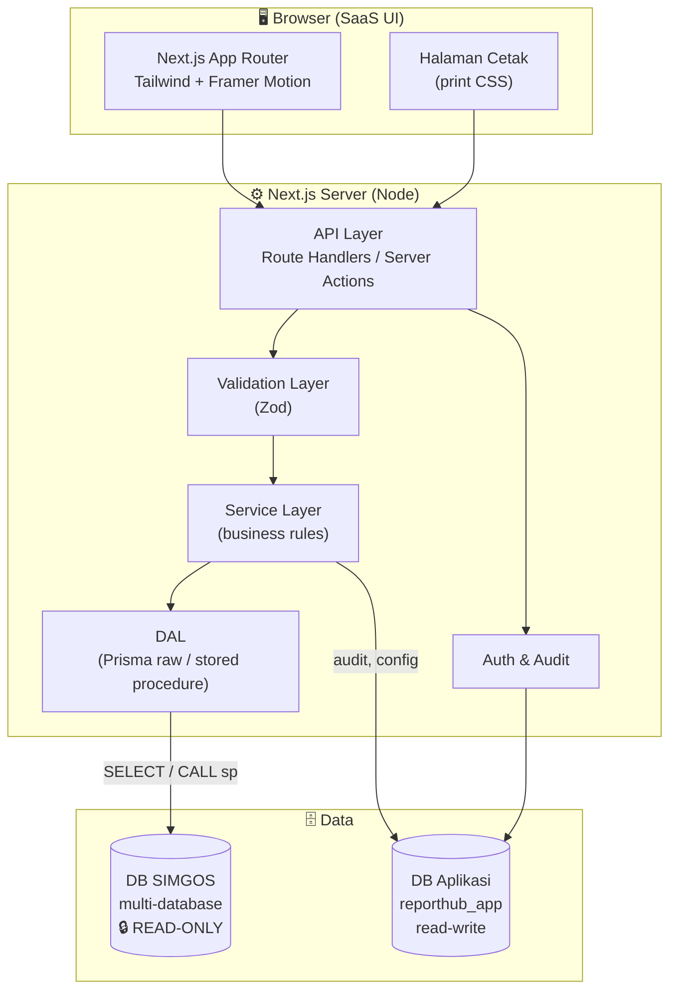
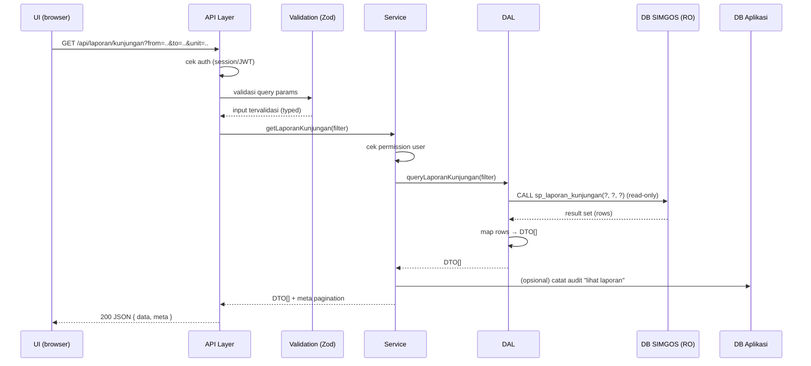

# 01 — Arsitektur Sistem

## 1. Gambaran Umum

ReportHub RSB adalah aplikasi **Next.js fullstack** yang menempel di samping
SIMGOS. Ia **tidak** menggantikan SIMGOS dan **tidak** menulis apa pun ke
databasenya — ia hanya **membaca** untuk menghasilkan report & cetakan yang
tidak disediakan SIMGOS.

Ada dua sumber data yang **terpisah tegas**:

- **DB SIMGOS** (multi-database, **read-only**) — sumber data medis/klinis.
- **DB Aplikasi** (`reporthub_app`, read-write) — milik kita: user, role, audit, konfigurasi report, filter tersimpan.



---

## 2. Strategi Dual-Database (inti dari HIGH ALERT)

Kenapa dua database?

- SIMGOS **haram diubah**. Tapi aplikasi SaaS butuh menyimpan state sendiri
  (siapa yang login, siapa mencetak resume medik, preset filter, dsb).
- Solusi: **semua state milik kita masuk ke DB aplikasi terpisah**. SIMGOS tetap
  murni sebagai sumber baca.

| | DB SIMGOS | DB Aplikasi (`reporthub_app`) |
|---|---|---|
| Kepemilikan | SIMGOS (existing) | ReportHub (kita) |
| Akses | **READ-ONLY** (`SELECT`, `EXECUTE`) | Read-write penuh |
| Prisma | `db pull` saja (introspect) | `migrate` normal |
| User MySQL | `reporthub_ro` (hak minimal) | `reporthub_app` |
| Isi | Data pasien, kunjungan, medis | User, role, session, audit log, report config, saved filter |
| Migrasi | **TIDAK PERNAH** | Ya (versioned) |

Dua **Prisma Client** terpisah:

- `simgos` → koneksi read-only ke SIMGOS.
- `app` → koneksi read-write ke DB aplikasi.

Detail: [03-database-prisma.md](./03-database-prisma.md).

---

## 3. Layering Backend

Setiap request melewati lapisan dengan tanggung jawab yang tegas. Prinsip:
**setiap lapisan hanya bicara ke lapisan tepat di bawahnya.**

```
Presentation (React)
        │  memanggil
        ▼
┌──────────────────────────────────────────────┐
│ API Layer  (Route Handler / Server Action)    │  HTTP, auth guard, format response
├──────────────────────────────────────────────┤
│ Validation Layer (Zod)                        │  parse & validasi input/output
├──────────────────────────────────────────────┤
│ Service Layer                                 │  business rules, orchestrasi, permission
├──────────────────────────────────────────────┤
│ DAL (Data Access Layer)                       │  Prisma raw / stored procedure / query
└──────────────────────────────────────────────┘
        │
        ▼
   DB SIMGOS (read-only) + DB Aplikasi
```

| Lapisan | Tanggung jawab | Boleh | Tidak boleh |
|---|---|---|---|
| **API** | Terima HTTP, auth, panggil validation → service, bentuk response & error HTTP | Tahu `Request`/`Response` | Query DB langsung, business logic |
| **Validation** | Validasi & parsing input (Zod), definisi bentuk output DTO | Definisikan schema | Akses DB |
| **Service** | Aturan bisnis (mis. resume medik hanya untuk kunjungan selesai), orchestrasi banyak DAL, cek permission, audit | Panggil banyak DAL, panggil `app` client untuk audit | Tahu HTTP, tahu SQL mentah |
| **DAL** | Eksekusi query/SP, kembalikan baris mentah + mapping ke DTO | Prisma `$queryRaw`, `CALL sp` | Business rule, tahu HTTP |

Detail & contoh kontrak tiap lapisan: [04-backend-layering.md](./04-backend-layering.md).

---

## 4. Alur Request (contoh: Laporan Kunjungan Pasien)



---

## 5. Modul Fitur

Kode diorganisir **per fitur (modular)**, bukan per tipe teknis. Setiap modul
berisi lapisan lengkapnya sendiri.

```
server/modules/
  kunjungan/            → Menu "Kunjungan Pasien"
  laporan-kunjungan/    → Report "Laporan Kunjungan Pasien"
  resume-medik/         → Report "Cetak Resume Medik"
```

Setiap modul: `*.dal.ts`, `*.service.ts`, `*.schema.ts` (Zod), `*.mapper.ts`,
`*.types.ts`. Struktur lengkap: [02-tech-stack-struktur.md](./02-tech-stack-struktur.md).

---

## 6. Akses Data SIMGOS: Stored Procedure & Raw Query

- **Stored procedure** dipanggil via `simgos.$queryRawUnsafe('CALL sp_xxx(?, ?)', p1, p2)`
  dengan parameter **selalu di-bind** (anti SQL injection).
- Nama SP **tidak boleh** datang dari input user. Semua SP/query yang diizinkan
  didaftarkan di **SP Registry** (whitelist).
- Untuk data yang belum ada SP-nya, DAL memakai **raw SELECT parameterized**
  dengan nama ter-kualifikasi `database.tabel` (karena SIMGOS multi-database).
- Langkah awal implementasi: **discovery** SP & tabel yang tersedia
  (`information_schema.ROUTINES`, `SHOW DATABASES`). Lihat [03-database-prisma.md](./03-database-prisma.md).

---

## 7. Mode Cetak (Print)

Dua target render, bertahap:

1. **Fase awal — Browser print (CSS `@media print`).**
   Route khusus tanpa sidebar, layout A4/kertas, panggil `window.print()`.
   Contoh: `/print/resume-medik/[kunjunganId]`.
2. **Fase lanjut — Server PDF (Puppeteer).**
   Render route cetak yang sama menjadi PDF di server untuk arsip/konsistensi.

Halaman cetak memakai **data DTO yang sama** dari service — hanya presentasinya
yang berbeda. Detail: [workflows/cetak-resume-medik.md](./workflows/cetak-resume-medik.md).

---

## 8. Prinsip Non-Fungsional

| Aspek | Pendekatan |
|---|---|
| **Keamanan** | Auth wajib, user DB read-only, audit akses data medis, parameterized query |
| **Kinerja** | Pagination server-side, index-aware query, caching ringan untuk data master |
| **Keterbacaan** | Modular per fitur, typed DTO, penamaan konsisten |
| **Ketahanan** | Error terstruktur (`Result`/error class), tidak membocorkan detail DB ke UI |
| **Auditability** | Setiap cetak resume medik tercatat: siapa, kapan, kunjungan mana |

Lanjut ke → [02-tech-stack-struktur.md](./02-tech-stack-struktur.md)
