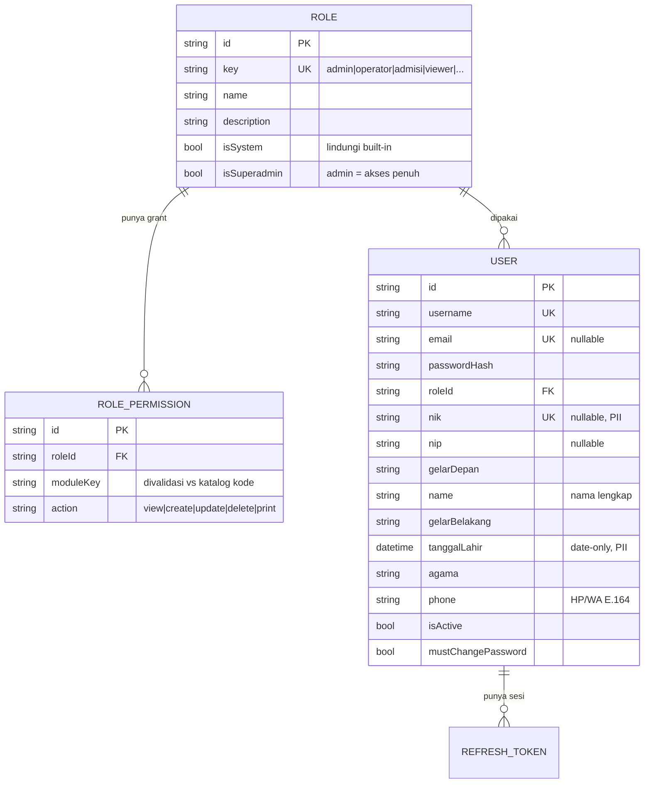

# 01 — Model Data RBAC & Profil Pengguna

> Semua state RBAC ada di **DB aplikasi `reporthub`** (read-write). **Tidak ada**
> perubahan di SIMGOS. Sumber skema: `prisma/app/schema.prisma` → generate ke
> `src/generated/app`. Tabel dibuat/diubah via **DDL manual** (bukan
> `prisma migrate`), lalu di-seed via skrip Node (lihat §6–§7).

---

## 1. Entitas & Relasi



**Kenapa `moduleKey` string, bukan tabel `Permission` ber-FK?**
Modul didefinisikan di **kode** (katalog, lihat [03-katalog-modul.md](./03-katalog-modul.md)) —
itu sumber kebenarannya. `moduleKey` + `action` divalidasi terhadap katalog **saat
tulis** (create/update grant). Ini menghindari langkah sinkronisasi tabel dan
mencegah grant menunjuk modul yang tak ada rutenya. (Alternatif tabel `Permission`
ber-seed dibahas di §8 — ditolak untuk MVP demi kesederhanaan.)

---

## 2. Perubahan `prisma/app/schema.prisma`

### 2.1 Hapus `enum Role`, tambah model `Role` + `RolePermission`

```prisma
/// Peran aplikasi (dinamis). `admin` = superadmin (akses penuh implisit).
/// `isSystem` melindungi peran bawaan dari dihapus/di-rename.
model Role {
  id           String   @id @default(cuid())
  key          String   @unique                 // slug stabil: "admin","operator","admisi","viewer"
  name         String                            // label tampilan
  description  String?
  isSystem     Boolean  @default(false) @map("is_system")
  isSuperadmin Boolean  @default(false) @map("is_superadmin")
  createdAt    DateTime @default(now()) @map("created_at")
  updatedAt    DateTime @updatedAt @map("updated_at")

  permissions RolePermission[]
  users       User[]

  @@map("roles")
}

/// Grant: kehadiran baris = izin diberikan. `moduleKey`/`action` divalidasi
/// terhadap katalog modul di kode (src/server/rbac/modules.ts).
model RolePermission {
  id        String   @id @default(cuid())
  roleId    String   @map("role_id")
  role      Role     @relation(fields: [roleId], references: [id], onDelete: Cascade)
  moduleKey String   @map("module_key")          // mis. "master.pengguna"
  action    String   @default("view")            // "view"|"create"|"update"|"delete"|"print"
  createdAt DateTime @default(now()) @map("created_at")

  @@unique([roleId, moduleKey, action])
  @@index([roleId])
  @@map("role_permissions")
}
```

### 2.2 Ubah model `User`

```prisma
model User {
  id           String    @id @default(cuid())
  username     String    @unique
  email        String?   @unique
  passwordHash String    @map("password_hash")

  // Peran: FK menggantikan `enum Role` lama.
  roleId String @map("role_id")
  role   Role   @relation(fields: [roleId], references: [id])

  // --- Profil (diisi di modal Tambah Akun) ---
  nik           String?   @unique                      // 16 digit — PII sensitif
  nip           String?                                 // NIP pegawai
  gelarDepan    String?   @map("gelar_depan")
  name          String                                  // NAMA LENGKAP
  gelarBelakang String?   @map("gelar_belakang")
  tanggalLahir  DateTime? @map("tanggal_lahir") @db.Date // date-only — PII
  agama         String?
  phone         String?                                 // No. HP/WA (E.164)

  isActive           Boolean   @default(true)  @map("is_active")
  mustChangePassword Boolean   @default(true)  @map("must_change_password")
  lastLoginAt        DateTime? @map("last_login_at")
  createdBy          String?   @map("created_by")
  updatedBy          String?   @map("updated_by")
  createdAt          DateTime  @default(now()) @map("created_at")
  updatedAt          DateTime  @updatedAt      @map("updated_at")

  refreshTokens RefreshToken[]

  @@index([roleId])
  @@map("users")
}
```

> **Dampak ke kode auth yang ada:** klaim JWT `role` kini diisi dari `role.key`
> (bukan enum). `auth.dal.findUserByUsername/ById` perlu `include: { role: true }`.
> `auth.service` mengisi `role: user.role.key`. Detail migrasi kompatibel di §5.

---

## 3. Field Profil — Pemetaan & Aturan

| Field UI (permintaan) | Kolom | Tipe | Wajib | Catatan |
|---|---|---|---|---|
| NIK | `nik` | varchar(16) UNIQUE, null | tidak | **PII**. Jika diisi: tepat 16 digit. Unik. |
| NIP | `nip` | varchar(30), null | tidak | Nomor induk pegawai. **Bukan** `username` — username field mandiri. |
| Gelar depan | `gelarDepan` | varchar(30), null | tidak | mis. "dr.", "Ns." |
| Nama lengkap | `name` | varchar(120) | **ya** | Tanpa gelar. |
| Gelar belakang | `gelarBelakang` | varchar(40), null | tidak | mis. "S.Kep", "SpA" |
| Tanggal lahir | `tanggalLahir` | DATE, null | tidak | **PII**. Date-only (tanpa jam/timezone). |
| Agama | `agama` | varchar(30), null | tidak | Enum aplikasi (lihat [04](./04-master-pengguna.md) §4). |
| No. HP/WA | `phone` | varchar(20), null | tidak | Normalisasi ke `+62…` (E.164). |

**Field akun (di luar daftar profil, tetap wajib untuk RBAC/login):**
`username` (unik, lowercase), `passwordHash` (bcrypt), `roleId`, `isActive`,
`mustChangePassword`. Rasional & default ada di [04-master-pengguna.md](./04-master-pengguna.md) §3.

> **Nama tampilan lengkap** dirakit saat render:
> `TRIM(gelarDepan + " " + name + ", " + gelarBelakang)` — bukan disimpan ganda.

---

## 4. Seed Peran & Grant Awal

| Peran (`key`) | `name` | `isSystem` | `isSuperadmin` | Grant awal |
|---|---|:---:|:---:|---|
| `admin` | Administrator | ✅ | ✅ | **Semua** (implisit, tanpa baris grant) |
| `operator` | Operator | ✅ | ❌ | `kunjungan:view`, `monitoring.*:view`, `berkas-klaim:view`, `form-rm:*`, `laporan:view` |
| `viewer` | Viewer | ✅ | ❌ | `kunjungan:view`, `laporan:view`, `monitoring.*:view` |

- Peran non-superadmin **tidak** otomatis dapat `master.*` — hanya `admin`.
- Peran kustom baru (mis. `admisi`) dibuat lewat UI **Peran & Hak Akses** dan
  default **kosong** sampai diberi grant.

> **Superadmin tanpa baris grant:** kode `can()` melakukan short-circuit bila
> `role.isSuperadmin` → selalu `true`. Jadi modul baru yang ditambah nanti
> otomatis bisa diakses admin **tanpa** perlu seed grant baru.

---

## 5. Migrasi `enum Role` → `roleId` (kompatibel-mundur)

Karena kolom lama `users.role` bertipe ENUM dan dibaca oleh login yang berjalan,
migrasi dilakukan **bertahap tanpa downtime**:

1. **Buat** tabel `roles` + `role_permissions`, seed 3 peran sistem (§4).
2. **Tambah** kolom `users.role_id` (nullable dulu) + kolom profil baru.
3. **Backfill**: `role_id` diisi dari enum lama
   (`ADMIN→admin`, `OPERATOR→operator`, `VIEWER→viewer`).
4. **Deploy kode** yang membaca `role.key` (join) dan menulis `role_id` untuk user
   baru. Login lama tetap jalan (enum masih ada, diabaikan).
5. **Jadikan `role_id` NOT NULL** + FK setelah backfill terverifikasi.
6. **(Belakangan, opsional)** DROP kolom enum `users.role` setelah yakin tak ada
   pembaca tersisa. Simpan sebagai langkah terpisah agar mudah rollback.

DDL langkah 1–3 & 5 ada di §6. Backfill user `admin` yang sudah ada → peran `admin`.

---

## 6. DDL (idempoten) — `scripts/db/rbac.sql`

> Dijalankan manual terhadap DB `reporthub` (bukan SIMGOS). Aman diulang.

```sql
-- 1) Tabel peran
CREATE TABLE IF NOT EXISTS roles (
  id            VARCHAR(30)  NOT NULL PRIMARY KEY,
  `key`         VARCHAR(40)  NOT NULL,
  name          VARCHAR(80)  NOT NULL,
  description   VARCHAR(255) NULL,
  is_system     TINYINT(1)   NOT NULL DEFAULT 0,
  is_superadmin TINYINT(1)   NOT NULL DEFAULT 0,
  created_at    DATETIME(3)  NOT NULL DEFAULT CURRENT_TIMESTAMP(3),
  updated_at    DATETIME(3)  NOT NULL DEFAULT CURRENT_TIMESTAMP(3),
  UNIQUE KEY uq_roles_key (`key`)
) ENGINE=InnoDB DEFAULT CHARSET=utf8mb4;

-- 2) Grant per peran
CREATE TABLE IF NOT EXISTS role_permissions (
  id         VARCHAR(30) NOT NULL PRIMARY KEY,
  role_id    VARCHAR(30) NOT NULL,
  module_key VARCHAR(60) NOT NULL,
  action     VARCHAR(20) NOT NULL DEFAULT 'view',
  created_at DATETIME(3) NOT NULL DEFAULT CURRENT_TIMESTAMP(3),
  UNIQUE KEY uq_role_module_action (role_id, module_key, action),
  KEY idx_rp_role (role_id),
  CONSTRAINT fk_rp_role FOREIGN KEY (role_id) REFERENCES roles(id) ON DELETE CASCADE
) ENGINE=InnoDB DEFAULT CHARSET=utf8mb4;

-- 3) Kolom baru di users (jalankan hanya bila belum ada — cek information_schema)
ALTER TABLE users
  ADD COLUMN role_id             VARCHAR(30) NULL AFTER password_hash,
  ADD COLUMN nik                 VARCHAR(16) NULL,
  ADD COLUMN nip                 VARCHAR(30) NULL,
  ADD COLUMN gelar_depan         VARCHAR(30) NULL,
  ADD COLUMN gelar_belakang      VARCHAR(40) NULL,
  ADD COLUMN tanggal_lahir       DATE        NULL,
  ADD COLUMN agama               VARCHAR(30) NULL,
  ADD COLUMN phone               VARCHAR(20) NULL,
  ADD COLUMN must_change_password TINYINT(1) NOT NULL DEFAULT 1,
  ADD COLUMN created_by          VARCHAR(30) NULL,
  ADD COLUMN updated_by          VARCHAR(30) NULL,
  ADD UNIQUE KEY uq_users_nik (nik);

-- 5) Setelah backfill role_id terverifikasi:
-- ALTER TABLE users MODIFY role_id VARCHAR(30) NOT NULL,
--   ADD CONSTRAINT fk_users_role FOREIGN KEY (role_id) REFERENCES roles(id);
```

> `ALTER TABLE ... ADD COLUMN` **tidak** idempoten di MariaDB lama. Jalankan lewat
> skrip Node yang cek `information_schema.COLUMNS` dulu (pola sama seperti skrip
> probe: `createRequire` + driver `mariadb`), atau bungkus tiap `ADD` terpisah dan
> abaikan error "duplicate column". Lihat [05-rencana-implementasi.md](./05-rencana-implementasi.md) §3.

---

## 7. Seed via Node — `scripts/db/seed-rbac.mjs`

Pola mengikuti skrip DB yang sudah dipakai (jalankan via **PowerShell** →
`C:\Program Files\nodejs\node.exe`, karena Bash sandbox tak bisa menjangkau LAN).

Langkah skrip:

1. Parse `DATABASE_URL_APP` dari `.env` (skip baris `#`).
2. `INSERT ... ON DUPLICATE KEY UPDATE` 3 peran sistem (§4) dengan `id` deterministik
   (mis. `role_admin`, `role_operator`, `role_viewer`) supaya idempoten.
3. Insert grant awal operator/viewer (superadmin tak butuh grant).
4. **Backfill**: `UPDATE users SET role_id = 'role_admin' WHERE role='ADMIN' AND role_id IS NULL;`
   (dan operator/viewer). Set `must_change_password=0` untuk user lama agar tak
   dipaksa ganti sandi.
5. Log ringkasan (jumlah baris terpengaruh). **Jangan** log data pengguna/sandi.

> **Alternatif Prisma:** karena app sudah punya `getAppDb()` (Prisma + adapter
> mariadb), seed bisa juga ditulis sebagai skrip TS yang meng-`import` client
> app dan pakai `upsert`. Pilih salah satu; DDL (`CREATE TABLE`) tetap SQL manual.

---

## 8. Alternatif yang Ditolak

- **Tabel `Permission` ber-FK (grant → permission_id).** Butuh langkah sinkron
  katalog↔DB tiap tambah modul; risiko drift. Ditolak: katalog kode + validasi
  saat tulis sudah cukup dan lebih sederhana.
- **Pertahankan `enum Role` + peta izin statis di kode.** Tak bisa dikelola admin
  tanpa deploy; tak memenuhi "beri permission per modul" secara dinamis. Ditolak.
- **Simpan izin langsung per-user (tanpa peran).** Sulit dikelola saat user
  banyak; RBAC berbasis peran lebih rapi. (Bisa ditambah "izin ekstra per-user"
  di fase lanjut bila perlu — di luar lingkup.)

Lanjut ke → [02-otorisasi.md](./02-otorisasi.md)
