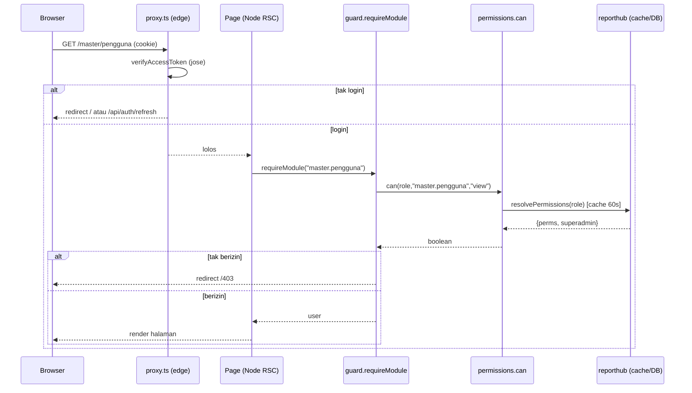

# 02 — Alur Otorisasi (Authn vs Authz)

> **Autentikasi (authn)** = "siapa kamu / sudah login?" — sudah ada, di `proxy.ts`.
> **Otorisasi (authz)** = "boleh akses modul ini?" — yang dibangun di dokumen ini.
> Prinsip: **penegakan di server** dengan **fail closed**.

---

## 1. Pembagian Tanggung Jawab

| Lapis | Berjalan di | Tugas | Akses DB? |
|---|---|---|---|
| `src/proxy.ts` | Edge | **Authn**: JWT valid? kalau tidak → redirect login/refresh | ❌ (jose saja) |
| Guard halaman | Node (Server Component) | **Authz**: user berhak modul? kalau tidak → 403 | ✅ |
| Guard API `withPermission` | Node (Route Handler) | **Authz**: sama, untuk endpoint | ✅ |
| Filter menu | Client/Server render | **UX**: sembunyikan menu tak berizin | ✅ (via server) |

> **Kenapa authz tidak di proxy?** Proxy berjalan di **edge runtime** dan **tidak
> boleh** menyentuh DB (memori [[app-db-auth]]: "edge, jose only, NO DB"). Resolusi
> izin butuh DB → dilakukan di Node. Proxy tetap gerbang login; authz per-modul
> ada satu lapis lebih dalam.

---

## 2. Klaim JWT — Tetap Ramping

Klaim access token **tidak berubah bentuk** (lihat `src/server/auth/tokens.ts`):

```ts
export type AccessClaims = { sub: string; username: string; name: string; role: string };
```

- `role` sekarang berisi **`role.key`** (mis. `"admin"`, `"operator"`), bukan enum.
- **Izin (permission) TIDAK dimasukkan ke token.** Alasan (Keputusan D5):
  1. Token tetap kecil (izin bisa banyak).
  2. Perubahan grant peran berlaku cepat (≤ TTL cache resolusi), **tanpa** harus
     menunggu refresh token 15 menit.
  3. Edge tak perlu tahu izin (ia hanya authn).

> **Konsekuensi & mitigasi freshness:**
> - **Grant peran berubah** (mis. peran "operator" dicabut akses modul X) →
>   berlaku dalam **≤ TTL cache** (default 30–60 dtk) untuk semua guard.
> - **Peran user diganti** (user dipindah dari operator ke viewer) → klaim `role`
>   masih lama sampai refresh (≤15m) / login ulang. Untuk **efek langsung**: admin
>   klik "Akhiri sesi" (panggil `revokeAllUserTokens(userId)`) atau nonaktifkan
>   akun (`isActive=false` → login & refresh gagal).

---

## 3. Katalog & Fungsi Inti `can()`

Sumber kebenaran modul ada di kode (lihat [03-katalog-modul.md](./03-katalog-modul.md)).
Resolusi izin dan pengecekan ada di `src/server/rbac/`:

```
src/server/rbac/
  modules.ts       # KATALOG modul (const, typed) — sumber kebenaran
  permissions.ts   # resolvePermissions(roleKey) + cache TTL; can()
  guard.ts         # requireModule() [page], withPermission()/authorize() [API]
```

```ts
// src/server/rbac/permissions.ts  (garis besar)
import "server-only";
import { getAppDb } from "@/server/db/app.client";
import { isValidModuleAction } from "./modules";

export type PermSet = Set<string>;               // isi: "moduleKey:action"
type Cached = { perms: PermSet; superadmin: boolean; at: number };

const TTL_MS = 60_000;
const cache = new Map<string, Cached>();          // key = roleKey

/** roleKey → izin efektif. Superadmin → set kosong + flag true (short-circuit). */
export async function resolvePermissions(roleKey: string): Promise<Cached> {
  const hit = cache.get(roleKey);
  if (hit && Date.now() - hit.at < TTL_MS) return hit;

  const role = await getAppDb().role.findUnique({
    where: { key: roleKey },
    include: { permissions: true },
  });
  const superadmin = !!role?.isSuperadmin;
  const perms: PermSet = new Set(
    (role?.permissions ?? [])
      .filter((p) => isValidModuleAction(p.moduleKey, p.action)) // buang grant usang
      .map((p) => `${p.moduleKey}:${p.action}`),
  );
  const val = { perms, superadmin, at: Date.now() };
  cache.set(roleKey, val);
  return val;
}

/** Invalidasi cache saat admin mengubah grant sebuah peran. */
export function invalidateRole(roleKey: string) { cache.delete(roleKey); }
export function invalidateAll() { cache.clear(); }

/** Cek satu izin. `view` dianggap terpenuhi bila punya aksi apa pun di modul itu? -> TIDAK.
 *  Aksi diperiksa eksplisit; "view" adalah baseline untuk membuka modul. */
export async function can(roleKey: string, moduleKey: string, action = "view"): Promise<boolean> {
  const { perms, superadmin } = await resolvePermissions(roleKey);
  if (superadmin) return true;
  return perms.has(`${moduleKey}:${action}`);
}
```

> **Fail closed:** bila `resolvePermissions` melempar (mis. DB pool timeout), `can()`
> tidak menelan error jadi `true`. Guard menangkapnya dan menolak akses (503/403),
> bukan meloloskan. Jangan pernah `catch → return true`.

---

## 4. Guard Halaman (Server Component)

Dipanggil di awal `page.tsx`/`layout.tsx` modul terproteksi.

```ts
// src/server/rbac/guard.ts
import "server-only";
import { redirect } from "next/navigation";
import { getCurrentUser } from "@/server/auth/session";
import { can } from "./permissions";

/** Untuk halaman. Belum login → ke login; tak berizin → ke /403. */
export async function requireModule(moduleKey: string, action = "view") {
  const user = await getCurrentUser();
  if (!user) redirect("/");                       // proxy biasanya sudah handle
  if (!(await can(user.role, moduleKey, action))) redirect("/403");
  return user;                                    // typed SessionUser utk dipakai halaman
}
```

Pemakaian — proteksi **satu grup** lewat `layout.tsx` grup (paling ringkas):

```tsx
// src/app/(dashboard)/master/layout.tsx
import { requireModule } from "@/server/rbac/guard";
export default async function MasterLayout({ children }: { children: React.ReactNode }) {
  await requireModule("master.pengguna");         // seluruh /master butuh izin ini
  return <>{children}</>;
}
```

- Halaman `/403` = Server Component sederhana (pesan "Tidak punya akses" + tombol
  kembali). **Bukan** `notFound()` supaya user paham ini soal izin, bukan URL salah.
  (Untuk modul yang keberadaannya pun rahasia, boleh pilih `notFound()`.)

---

## 5. Guard API (`withPermission`)

Bungkus setiap handler modul. Mengembalikan **401** (belum login) atau **403**
(tak berizin) memakai helper `fail()` yang sudah ada.

```ts
// src/server/rbac/guard.ts (lanjutan)
import { NextRequest } from "next/server";
import { fail } from "@/server/lib/http";
import { ForbiddenError, UnauthorizedError } from "@/server/lib/errors";

type Ctx = { params: Promise<Record<string, string>> };
type Handler = (req: NextRequest, ctx: Ctx, user: SessionUser) => Promise<Response>;

/** HOF untuk route handler: authn + authz sebelum handler jalan. */
export function withPermission(moduleKey: string, action: string, handler: Handler) {
  return async (req: NextRequest, ctx: Ctx) => {
    try {
      const user = await getCurrentUser();
      if (!user) throw new UnauthorizedError();
      if (!(await can(user.role, moduleKey, action))) throw new ForbiddenError();
      return await handler(req, ctx, user);
    } catch (err) {
      return fail(err);                            // 401/403/500 terstandar
    }
  };
}
```

Pemakaian:

```ts
// src/app/api/master/pengguna/route.ts
import { withPermission } from "@/server/rbac/guard";
export const runtime = "nodejs";

export const GET  = withPermission("master.pengguna", "view",   async (req, _ctx, user) => { /* list */ });
export const POST = withPermission("master.pengguna", "create", async (req, _ctx, user) => { /* create */ });
```

> **Peta prefix API → modul** ([03-katalog-modul.md](./03-katalog-modul.md) §3)
> adalah **kontrak**: tiap endpoint di bawah prefix suatu modul **wajib** dibungkus
> `withPermission` modul itu. Lint/CI bisa mengecek tiap `route.ts` di bawah
> `api/<prefix>` mengekspor handler ber-`withPermission` (lihat
> [05-rencana-implementasi.md](./05-rencana-implementasi.md) §6).

### 5.1 Endpoint yang dikecualikan

- `/api/auth/*` — sudah dikecualikan proxy; **tidak** pakai `withPermission`
  (login/refresh harus jalan sebelum ada peran).
- `/api/sign/*` & `/sign/*` — publik (dijaga token acak, lihat `PUBLIC_PREFIXES`
  di `proxy.ts`); tetap dikecualikan.
- Endpoint "milik sendiri" (mis. `change-password`) tetap butuh **login** tapi
  tak butuh izin modul.

---

## 6. Peran `proxy.ts` (tak berubah banyak)

`proxy.ts` **tetap** hanya authn. Tidak menambah cek DB di edge. Satu-satunya
penyesuaian opsional: setelah login, arahkan ke **home yang boleh diakses user**
alih-alih `DEFAULT_HOME` tetap. Karena proxy tak tahu izin, penentuan "home efektif"
lebih tepat dilakukan di **Server Component** halaman landing (mis. `/` pasca-login
redirect → halaman pertama yang diizinkan). Ini penyempurnaan UX, bukan keamanan.

---

## 7. Filter Menu (UX)

Menu di `nav.ts` diberi `moduleKey` per item. Layout dashboard me-resolve izin user
sekali (server), lalu mengirim daftar modul yang boleh ke `AppShell`/`Sidebar`:

```tsx
// src/app/(dashboard)/layout.tsx  (garis besar)
const user = await getCurrentUser();
const allowed = user ? await allowedModuleKeys(user.role) : new Set<string>();
// NAV difilter: hanya item yang moduleKey-nya ada di `allowed`; section kosong disembunyikan.
```

- `allowedModuleKeys(roleKey)` mengembalikan `Set<string>` modul yang punya minimal
  aksi `view` (superadmin → semua key katalog).
- **Ini murni UX.** Menyembunyikan menu **tidak** menggantikan guard halaman/API.

---

## 8. Sequence — Akses Halaman & API



Untuk API, alurnya identik dengan `withPermission` di posisi guard, menghasilkan
`401`/`403` JSON alih-alih redirect.

---

## 9. Uji Keamanan (wajib sebelum rilis)

- [ ] User tanpa izin `master.pengguna` → buka `/master/pengguna` **redirect /403**.
- [ ] User tanpa izin → `GET /api/master/pengguna` **403 JSON**, bukan 200.
- [ ] Akses langsung endpoint mutasi (`POST/PATCH`) tanpa aksi `create/update` → **403**.
- [ ] Menu Master **tidak muncul** untuk user tanpa izin (UX), tapi pemblokiran
      nyata tetap dari guard (uji dengan menembak URL/endpoint langsung).
- [ ] Cabut grant peran → efektif **≤ TTL cache** (uji dgn `invalidateRole`).
- [ ] Nonaktifkan user (`isActive=false`) → login & refresh **gagal**.
- [ ] DB error saat resolusi izin → akses **ditolak** (fail closed), bukan lolos.
- [ ] Superadmin (`admin`) → semua modul, termasuk modul yang **baru** ditambah
      tanpa seed grant.

Lanjut ke → [03-katalog-modul.md](./03-katalog-modul.md)
