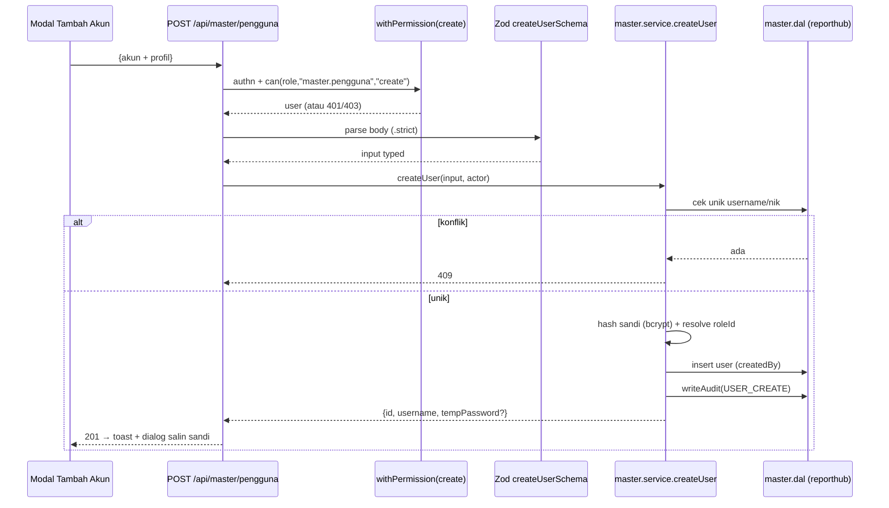

# 04 — Workflow: Master › Pengguna (Registrasi Akun)

> Grup menu baru **Master** dengan tab **Pengguna**: daftar akun + **modal Tambah
> Akun**. Ditambah tab **Peran & Hak Akses** untuk mengoperasikan RBAC (memberi izin
> modul ke peran). Semua endpoint dijaga izin `master.pengguna` / `master.peran`.

- **Modul:** `master.pengguna`, `master.peran`
- **Route UI:** `/(dashboard)/master/pengguna`, `/(dashboard)/master/peran`
- **API:** `/api/master/pengguna/**`, `/api/master/peran/**`
- **Izin:** `master.pengguna:{view,create,update,delete}`, `master.peran:{view,create,update,delete}`
- **Sumber data:** **DB aplikasi `reporthub`** (bukan SIMGOS)

---

## 1. Tujuan

Administrator dapat **mendaftarkan** akun petugas baru (dengan data profil),
menetapkan **peran**, mengaktifkan/menonaktifkan, dan me-reset sandi — sehingga
akses ke modul aplikasi terkendali oleh RBAC.

## 2. User Story

> Sebagai **administrator**, saya ingin menambah akun petugas lewat satu modal
> (NIK, NIP, gelar, nama, tanggal lahir, agama, no. HP/WA) dan memilih perannya,
> agar petugas bisa login dan hanya mengakses modul yang saya izinkan.

## 3. Struktur Halaman Master (Tabs)

```
/master
  ├─ /pengguna        (tab "Pengguna")      izin: master.pengguna
  └─ /peran           (tab "Peran & Hak Akses")  izin: master.peran
```

- `/(dashboard)/master/layout.tsx` → `await requireModule("master.pengguna")` untuk
  akses grup; tab kedua tambahan `requireModule("master.peran")` di halamannya.
  (Bila ingin akses grup cukup salah satu izin, longgarkan guard layout & jaga
  per-tab — putuskan saat implementasi; default: butuh `master.pengguna`.)
- Tab diimplementasikan sebagai dua route (bukan state) agar bisa di-deep-link &
  dijaga izin terpisah.

### Tab **Pengguna** — daftar + aksi

- **Tabel**: Nama (gelar depan + nama + gelar belakang) · Username · NIP · Peran
  (badge) · No. HP/WA · Status (Aktif/Nonaktif) · Login terakhir · Aksi.
- **Toolbar**: pencarian (nama/username/NIP), filter peran, filter status, tombol
  **+ Tambah Akun** (buka modal).
- **Aksi baris**: Edit, Reset sandi, Aktif/Nonaktif. **Tanpa hard delete** di UI
  (soft-deactivate; hard delete—bila ada—khusus superadmin, lihat §6).
- **NIK disamarkan** di tabel: tampil `••••••••••••1234` (4 digit akhir). Nilai penuh
  hanya di form Edit bagi yang berizin.

---

## 4. Modal "Tambah Akun" — Field & Validasi

Dua kelompok field. **Profil** = yang diminta user; **Akun** = wajib untuk login/RBAC.

### 4.1 Kelompok Akun

| Field | Wajib | Aturan (Zod) | Default/UX |
|---|:---:|---|---|
| Username | ya | lowercase, `^[a-z0-9._-]{3,30}$`, unik | **Prefill dari NIP** (bisa diubah) |
| Peran | ya | ada di tabel `roles` | Select peran (default: kosong → user pilih) |
| Sandi awal | ya¹ | min 8, tak sama username, cek daftar sandi lemah | **Generate** tombol "Buat sandi" → tampil sekali |
| Wajib ganti sandi | — | boolean | Default **true** (dipaksa ganti saat login pertama) |
| Status aktif | — | boolean | Default **true** |

¹ Alternatif: tanpa input sandi, **selalu** auto-generate sandi sementara +
`mustChangePassword=true`; admin menyalin/menyampaikan sandi sekali. **Rekomendasi:
auto-generate** (admin tak mengarang sandi lemah). Tampilkan sandi hasil generate
**satu kali** dalam dialog "salin sandi", tidak disimpan plaintext.

### 4.2 Kelompok Profil (sesuai permintaan)

| Field | Kolom | Wajib | Aturan (Zod) | Komponen UI |
|---|---|:---:|---|---|
| NIK | `nik` | tidak | kosong **atau** tepat 16 digit `^\d{16}$`, unik | `TextField` (inputMode numeric) |
| NIP | `nip` | tidak | 1..30 char | `TextField` |
| Gelar depan | `gelarDepan` | tidak | ≤30 | `TextField` (mis. "dr.") |
| Nama lengkap | `name` | **ya** | 2..120, trim | `TextField` |
| Gelar belakang | `gelarBelakang` | tidak | ≤40 | `TextField` (mis. "S.Kep., Ns.") |
| Tanggal lahir | `tanggalLahir` | tidak | tanggal valid, **tidak di masa depan**, ≥ 1900 | `DatePicker` (lihat [[ui-form-components]]) |
| Agama | `agama` | tidak | salah satu enum agama | `Select` |
| No. HP/WA | `phone` | tidak | normalisasi `08…`/`+62…` → E.164 `+62…`, 9..15 digit | `TextField` (inputMode tel) |

**Enum Agama** (Indonesia): `Islam`, `Kristen`, `Katolik`, `Hindu`, `Buddha`,
`Konghucu`, `Lainnya`. (Sederhana; bukan referensi SIMGOS — data ini milik aplikasi.)

**Normalisasi telepon:** buang spasi/tanda; `0…` → `+62…`; validasi panjang; simpan
E.164. Tolak jika bukan angka setelah normalisasi.

**Perilaku modal (UX, [[frontend-design]]):**
- Layout 2 kolom di ≥sm, 1 kolom di mobile; grup "Akun" dan "Profil" dipisah subjudul.
- Validasi inline (blur) + ringkasan error di atas tombol simpan.
- State tombol: default / loading (submitting) / disabled (form invalid).
- Fokus otomatis ke field pertama; ESC menutup; klik luar dikonfirmasi bila ada
  perubahan (cegah kehilangan input).
- Setelah sukses: modal tutup, baris baru muncul (optimistic/refresh), toast
  "Akun dibuat" + (bila auto-generate) dialog "Salin sandi sementara".

---

## 5. Kontrak API

Semua di bawah `runtime = "nodejs"`, dibungkus `withPermission` (lihat
[02-otorisasi.md](./02-otorisasi.md) §5). Respons standar `ok()`/`fail()`.

### 5.1 `GET /api/master/pengguna` — daftar `master.pengguna:view`

| Query | Tipe | Default | Ket. |
|---|---|---|---|
| `search` | string | — | nama/username/NIP |
| `roleKey` | string | — | filter peran |
| `status` | `aktif\|nonaktif` | — | filter status |
| `page` | int ≥1 | 1 | |
| `pageSize` | int 1..100 | 25 | |

**Response 200** — `{ data: UserListItem[], meta: { page,pageSize,total,totalPages } }`.
`UserListItem` **tidak** memuat `passwordHash`; `nik` **disamarkan** (server yang
memformat, atau kirim `nikMasked`). Contoh item:

```jsonc
{
  "id": "clx…",
  "username": "198… / budi",
  "namaLengkap": "dr. Budi Santoso, SpPD",
  "nip": "198703112010011002",
  "roleKey": "operator",
  "roleName": "Operator",
  "phone": "+62812xxxxxx",
  "nikMasked": "••••••••••••1234",
  "isActive": true,
  "lastLoginAt": "2026-08-10T02:11:00.000Z"
}
```

### 5.2 `POST /api/master/pengguna` — buat `master.pengguna:create`

Body = field Akun + Profil (§4). Server:
1. Validasi Zod (`createUserSchema`).
2. Cek unik `username` (& `nik` bila ada) → `409 CONFLICT` pesan jelas.
3. `passwordHash = bcrypt(sandi, 12)` (pakai `hashPassword` yang ada).
4. `roleId` di-resolve dari `roleKey` (validasi peran ada).
5. `create` user (`createdBy = user.id`, `mustChangePassword`).
6. **Audit** `USER_CREATE` (lihat §7). **Jangan** kembalikan sandi/harish; bila
   auto-generate, kembalikan `tempPassword` **sekali** di response create (tidak
   disimpan) untuk ditampilkan admin.

**Response 201** — `{ data: { id, username, tempPassword? } }`.

### 5.3 `GET /api/master/pengguna/[id]` — detail `:view`
Kembalikan profil lengkap (NIK penuh boleh, karena sudah berizin `master.pengguna`)
untuk form Edit. Tanpa `passwordHash`.

### 5.4 `PATCH /api/master/pengguna/[id]` — ubah `:update`
Ubah profil/peran/status. **Aturan aman:**
- Tak boleh menonaktifkan / mencabut peran **superadmin terakhir** (cek: jika target
  superadmin & ia satu-satunya aktif → tolak `409`).
- Ganti peran → berlaku setelah refresh token target (≤15m) / paksa via §5.6.
- Ubah `isActive=false` → panggil `revokeAllUserTokens(id)` agar sesi mati segera.

### 5.5 `POST /api/master/pengguna/[id]/reset-password` — `:update`
Set sandi baru (auto-generate atau input admin), `mustChangePassword=true`, lalu
`revokeAllUserTokens(id)` (paksa login ulang). Audit `USER_RESET_PASSWORD`.

### 5.6 `POST /api/master/pengguna/[id]/revoke-sessions` — `:update`
Cabut semua refresh token user (logout paksa semua perangkat). Audit `USER_REVOKE_SESSIONS`.

### 5.7 Peran & Hak Akses — `master.peran`
- `GET /api/master/peran` (`:view`) — daftar peran + jumlah user + ringkas grant.
- `POST /api/master/peran` (`:create`) — buat peran kustom (`key` slug unik, `name`).
- `PATCH /api/master/peran/[id]` (`:update`) — ubah nama/deskripsi. **`isSystem` tak
  bisa di-rename/hapus.**
- `PUT /api/master/peran/[id]/hak-akses` (`:update`) — set **matriks grant** (array
  `{moduleKey, action}` divalidasi `isValidModuleAction`). Superadmin tak bisa
  dikurangi (diabaikan/ditolak). Setelah simpan → `invalidateRole(roleKey)` agar
  efektif segera.
- `DELETE /api/master/peran/[id]` (`:delete`) — hanya peran non-system **tanpa user**
  (else `409`).

Error umum: `422` validasi, `401` belum login, `403` tak berizin, `409` konflik
(unik/aturan bisnis), `500` internal.

---

## 6. Layer Backend (mengikuti pola modul yang ada)

```
src/server/modules/master/
  master.schema.ts     # zod: createUserSchema, updateUserSchema, listQuerySchema,
                       #       roleSchema, setGrantsSchema (+ normalisasi phone/nik)
  master.dal.ts        # akses getAppDb(): user & role CRUD, cek unik, count
  master.service.ts    # aturan bisnis: hash, cek unik, guard superadmin-terakhir,
                       #                 audit, revoke sessions, invalidate cache
  master.mapper.ts     # row → DTO (mask NIK, rakit nama lengkap)
```

- **Import satu arah** API → Service → DAL (konvensi [../04-backend-layering.md](../04-backend-layering.md)).
- Reuse `hashPassword` (`src/server/auth/password.ts`), `revokeAllUserTokens`
  (`auth.dal`), `getCurrentUser`.
- **Soft delete:** `isActive=false`. **Hard delete** user: dihindari (jejak audit &
  FK refresh_tokens). Bila benar diperlukan, batasi ke superadmin + cascade sesi.

---

## 7. Keamanan & PII (WAJIB)

| Aspek | Aturan |
|---|---|
| Sandi | bcrypt rounds 12 (existing). **Tak pernah** plaintext di DB/log/response (kecuali `tempPassword` sekali saat create/reset). |
| NIK | **PII sensitif.** Disamarkan di list; nilai penuh hanya di detail/edit bagi `master.pengguna`. **Tak pernah** masuk log. Unik. |
| Tanggal lahir | PII — tidak ditampilkan di list; hanya di form edit. |
| Otorisasi | Semua endpoint `withPermission`. Aksi mutasi butuh `create/update/delete`, bukan sekadar `view`. |
| Anti-enumerasi | Pesan konflik username/NIK boleh spesifik **di UI admin** (bukan endpoint publik) — ini area admin, wajar. Login publik tetap generik. |
| Sesi | Nonaktif/ganti peran/reset sandi → `revokeAllUserTokens` agar efektif segera. |
| Audit | Tulis `AuditLog` (DB aplikasi) untuk `USER_CREATE/UPDATE/RESET_PASSWORD/REVOKE_SESSIONS/ROLE_GRANT_CHANGE`: `actorId`, `action`, `targetId`, `metadata` ringkas (tanpa PII penuh/sandi), `ip`, `at`. Tabel `AuditLog` **belum ada** → dibuat bersama modul ini (DDL + model), sejalan dgn [../06-security-konvensi.md](../06-security-konvensi.md) §3. |
| Input | Semua via Zod; phone/nik dinormalisasi sebelum simpan; tak ada field tak terduga (schema `.strict()`). |
| Self-guard | Admin tak bisa menonaktifkan/menurunkan **dirinya sendiri** bila jadi superadmin terakhir (cegah lockout). |

---

## 8. Edge Cases

| Kasus | Perilaku |
|---|---|
| Username sudah dipakai | `409` "Username sudah digunakan" |
| NIK sudah dipakai | `409` "NIK sudah terdaftar" |
| NIK diisi tapi bukan 16 digit | `422` field error |
| Peran tak ditemukan | `422`/`409` "Peran tidak valid" |
| Nonaktifkan superadmin terakhir | `409` "Minimal satu administrator aktif" |
| Reset sandi user nonaktif | Boleh, tetap `mustChangePassword=true` |
| Tanggal lahir masa depan | `422` |
| Telepon tak valid setelah normalisasi | `422` |
| Cabut grant peran yang sedang dipakai | Boleh; efektif ≤ TTL cache (invalidate) |
| Hapus peran yang masih punya user | `409` "Peran masih dipakai N pengguna" |

---

## 9. UI/UX (ringkas, [[frontend-design]] + [[ui-form-components]])

- **Halaman**: `PageHeader` "Master" + subjudul; `Tabs` (Pengguna | Peran & Hak Akses).
- **Tabel**: `Card` + tabel responsif; badge peran & status; skeleton loading; empty
  state ("Belum ada pengguna"); pagination server-side tersinkron URL.
- **Modal Tambah/Edit**: komponen `Modal` (portal, focus-trap, ESC/overlay),
  `Select`/`SelectOther` untuk Agama & Peran, `DatePicker` untuk tanggal lahir,
  tombol "Buat sandi". Reuse komponen di [[ui-form-components]] & [[remote-sign-handoff]] bila relevan.
- **Matriks Hak Akses**: grid peran × modul dengan checkbox per aksi
  (view/create/update/delete/print), superadmin ditampilkan "Akses penuh" (dikunci).
- **Aksesibilitas**: label terkait input, fokus terlihat, kontras AA, `aria` pada
  modal & switch. `prefers-reduced-motion` dihormati.

---

## 10. Sequence — Tambah Akun



---

## 11. Definition of Done

- [ ] Grup **Master** muncul di sidebar **hanya** untuk yang berizin; tab Pengguna &
      Peran ter-deep-link dan ter-guard terpisah.
- [ ] Modal Tambah Akun: semua field (NIK, NIP, gelar depan, nama, gelar belakang,
      tgl lahir, agama, HP/WA) + Akun (username, peran, sandi) tervalidasi Zod `.strict`.
- [ ] Endpoint list/create/detail/update/reset/revoke + peran/grant semuanya
      `withPermission` dengan aksi tepat; diuji 401/403/409/422.
- [ ] Sandi bcrypt; `tempPassword` hanya sekali; tak ada plaintext/harish di
      response/log.
- [ ] NIK & tgl lahir diperlakukan PII (mask di list, tak di-log).
- [ ] Nonaktif/ganti peran/reset → sesi target dicabut; guard superadmin-terakhir.
- [ ] Audit tercatat untuk semua mutasi.
- [ ] Matriks Hak Akses menyimpan grant tervalidasi katalog; perubahan efektif
      ≤ TTL cache; superadmin tak bisa dikurangi.
- [ ] `tsc` 0 error, `eslint` 0 error.

Lanjut ke → [05-rencana-implementasi.md](./05-rencana-implementasi.md)
