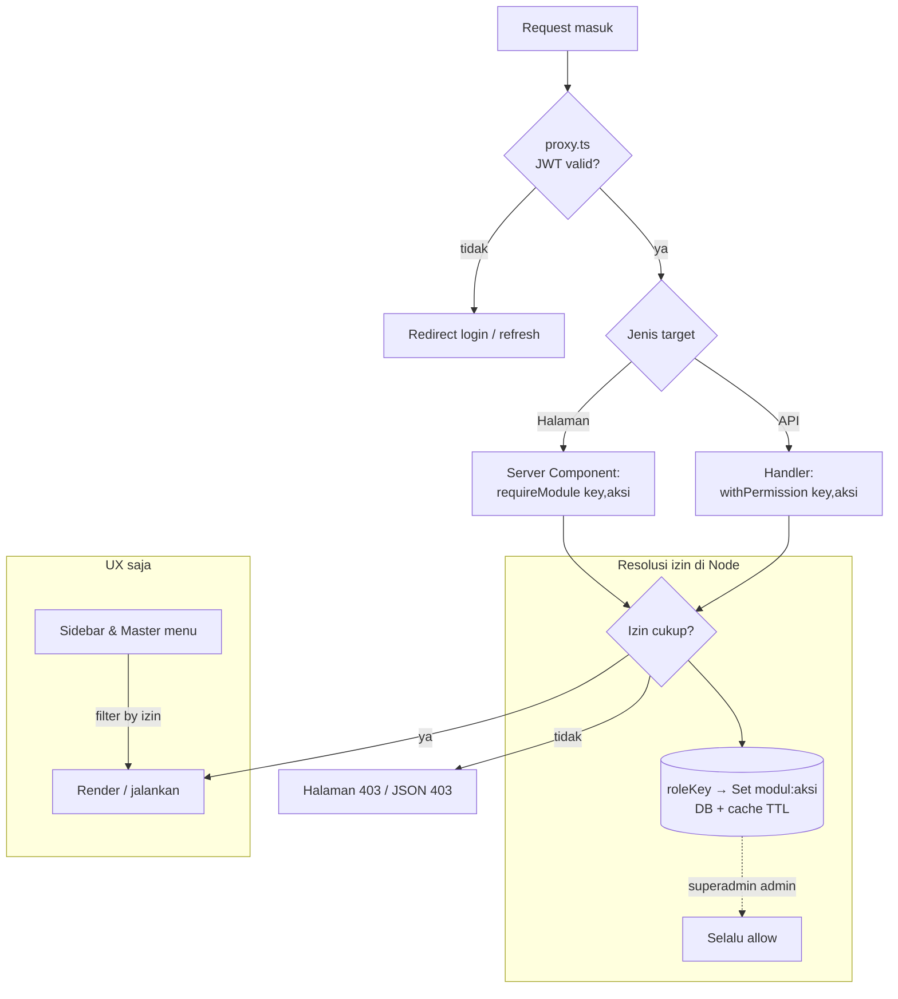

# RBAC & Registrasi Pengguna — Blueprint

> Sistem **kontrol akses berbasis peran (RBAC)** untuk ReportHub RSB, plus modul
> baru **Master › Pengguna** untuk registrasi/mengelola akun. Tujuan akhir:
> **hanya modul yang diberi izin (permission) yang bisa diakses** — baik dari
> sisi halaman (UI) maupun API — dengan penegakan yang **aman di server**, bukan
> sekadar menyembunyikan menu.

Status: 📄 **Perencanaan** — dokumen ini blueprint sebelum menulis kode.
Bahasa & gaya mengikuti [../README.md](../README.md) dan
[../06-security-konvensi.md](../06-security-konvensi.md).

---

## 1. Latar & Kondisi Saat Ini

Yang **sudah ada** (verifikasi kode, Agustus 2026):

| Komponen | Kondisi sekarang |
|---|---|
| Autentikasi | Custom JWT (`jose`): access 15m + refresh 7d rotasi, cookie httpOnly. `src/server/auth/*`. |
| Proxy (edge) | `src/proxy.ts` — hanya cek **login/tidak** (verifikasi JWT), **tanpa** cek izin. |
| Peran | `enum Role { ADMIN, OPERATOR, VIEWER }` di `prisma/app/schema.prisma`, kolom `users.role`. **Statis**, tak bisa diberi izin per-modul. |
| Klaim JWT | `sub`, `username`, `name`, `role` (string). |
| Menu | `src/components/layout/nav.ts` — array `NAV` **statis**, tampil semua tanpa filter izin. |
| API | Pola `ok()`/`fail()` + `getCurrentUser()` di handler; **belum** ada cek izin per-modul. |
| DB aplikasi | `reporthub` (read-write, milik kita). Tabel dibuat via **DDL script** (bukan `prisma migrate`). |

Yang **belum ada** dan akan dibangun:

- Peran **dinamis** + **matriks izin per-modul** yang tersimpan di DB.
- **Katalog modul** sebagai sumber kebenaran untuk proteksi halaman & API.
- **Guard** halaman & API berbasis izin, + **filter menu** sesuai izin.
- Modul **Master › Pengguna** (list + modal Tambah Akun) dan **Peran & Hak Akses**.
- Kolom profil pada `users`: NIK, NIP, gelar, tanggal lahir, agama, no. HP/WA.

> Catatan: [../06-security-konvensi.md](../06-security-konvensi.md) §2.2 sudah
> menyebut RBAC dengan tabel role→permission **statis**. Dokumen ini
> **menggantikan** pendekatan statis itu dengan RBAC **dinamis berbasis modul**.

---

## 2. Prinsip

1. **Penegakan di server, bukan di UI.** Menu yang disembunyikan hanyalah UX;
   halaman & API **wajib** memvalidasi izin di server. UI tidak pernah menjadi
   satu-satunya penjaga.
2. **Defense in depth.** Tiga lapis: (a) proxy = autentikasi, (b) guard halaman
   (Server Component), (c) guard API (`withPermission`). Bila satu lapis lolos
   karena bug, lapis lain masih menahan.
3. **Least privilege.** Peran diberi izin **seminimal** yang dibutuhkan. Peran
   baru default **tanpa** izin apa pun sampai diberikan eksplisit.
4. **Katalog modul = sumber kebenaran di kode.** Modul terikat ke rute/fitur yang
   benar-benar ada; hanya **grant** (peran→modul→aksi) yang disimpan di DB.
5. **Fail closed.** Bila izin tak bisa dipastikan (error resolusi, modul tak
   dikenal), akses **ditolak**, bukan diizinkan.
6. **Superadmin bypass semua peran/izin.** Peran `admin` = **superadmin**: memiliki
   **hak akses penuh ke seluruh sistem** dan **melewati (bypass) semua pengecekan
   izin** — `can()` selalu `true` untuknya, termasuk untuk modul yang **baru**
   ditambahkan nanti tanpa perlu seed grant. Dilindungi dari penghapusan/penurunan
   izin agar tidak ada kondisi "terkunci di luar".
7. **Data pribadi (PII) dijaga.** NIK & tanggal lahir sensitif — dibatasi izinnya,
   tak pernah masuk log, dan disamarkan di daftar.
8. **SIMGOS tetap READ-ONLY.** Semua state RBAC ada di DB aplikasi `reporthub`.
   RBAC **tidak menyentuh** SIMGOS sama sekali (HIGH ALERT).

---

## 3. Ringkasan Keputusan Arsitektur

| # | Topik | Keputusan | Alasan |
|---|---|---|---|
| D1 | Model izin | **Peran → Izin (grant) per modul+aksi**, peran **dinamis** di DB | Fleksibel, bisa dikelola admin tanpa deploy; standar RBAC |
| D2 | Katalog modul | **Didefinisikan di kode** (`src/server/rbac/modules.ts`); DB hanya simpan grant | Modul = fitur/rute nyata; cegah drift & grant "yatim" |
| D3 | Granularitas | **Modul + aksi** (`view`, `create`, `update`, `delete`, `print`) | Cukup halus untuk beda "lihat" vs "kelola"; MVP fokus `view`+`manage` |
| D4 | Tempat penegakan | Proxy = **authn**; Node (page guard + API `withPermission`) = **authz** | Edge tak boleh sentuh DB; izin di-resolve di Node |
| D5 | Sumber izin per-request | Klaim JWT bawa `role`; izin **di-resolve dari DB + cache in-proc TTL pendek** | Token tetap kecil; perubahan grant cepat berlaku (≤ TTL cache) tanpa nunggu refresh token |
| D6 | Superadmin | Peran `admin` bypass semua cek (`isSystem`, tak bisa dicabut/hapus) | Cegah "terkunci di luar" |
| D7 | Peran pada User | Ganti `enum Role` → FK `roleId` ke tabel `roles` | Peran dinamis butuh tabel, bukan enum |
| D8 | Prefix API | Tiap modul punya **prefix `/api/...`** yang dijaga izin modul itu | Sesuai permintaan: "tambahkan prefix modulnya" |
| D9 | Migrasi skema | **DDL manual + skrip seed** (idempoten), sinkron dgn `schema.prisma` | Ikuti konvensi DB aplikasi (bukan `prisma migrate`) |
| D10 | Hapus user | **Soft-deactivate** (`isActive=false`), bukan hard delete | Jejak audit & integritas referensi tetap terjaga |

Rincian & alternatif yang ditolak ada di masing-masing dokumen.

---

## 4. Peta Dokumen RBAC

| # | Dokumen | Isi |
|---|---|---|
| — | **README.md** (ini) | Ikhtisar, prinsip, keputusan, index |
| 01 | [01-model-data.md](./01-model-data.md) | Skema Prisma (Role, RolePermission, User profil), DDL, seed, migrasi enum→FK |
| 02 | [02-otorisasi.md](./02-otorisasi.md) | Authn vs authz, klaim JWT, resolusi izin + cache, guard halaman & API, sequence |
| 03 | [03-katalog-modul.md](./03-katalog-modul.md) | Katalog modul di kode, grup, peta prefix API, filter menu, cara menambah modul |
| 04 | [04-master-pengguna.md](./04-master-pengguna.md) | Grup Master, tab Pengguna, modal Tambah Akun, endpoint, validasi, PII |
| 05 | [05-rencana-implementasi.md](./05-rencana-implementasi.md) | Rencana bertahap, daftar file, pengujian, acceptance, rollout |

---

## 5. Gambaran Cepat (End-to-End)

Lanjut ke → [01-model-data.md](./01-model-data.md)
