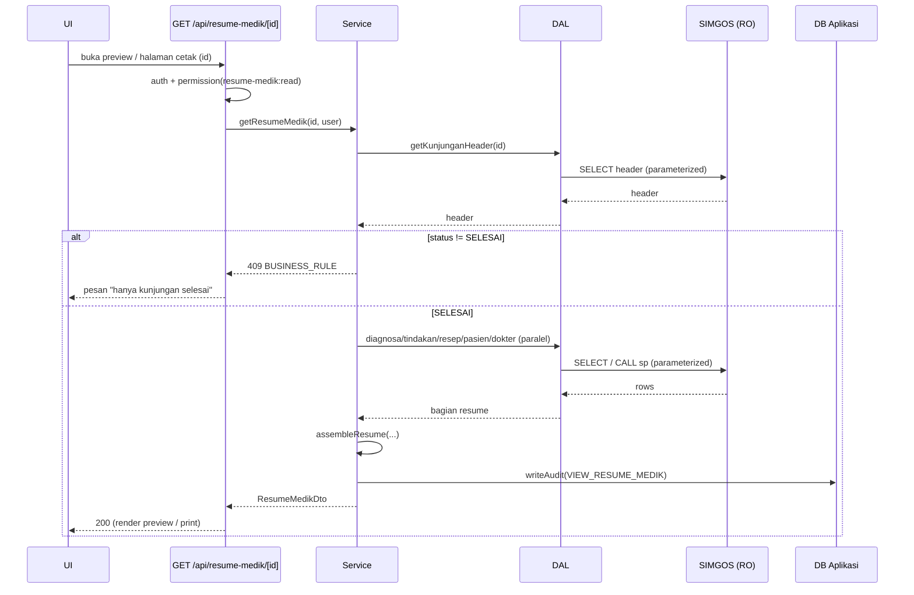

# Workflow — Cetak Resume Medik

> Mencari kunjungan yang **sudah selesai**, menampilkan **resume medik** pasien
> untuk kunjungan tersebut, lalu **mencetaknya**. Ini fitur paling sensitif
> (rekam medis) → wajib audit & kontrol akses ketat.

- **Modul:** `server/modules/resume-medik`
- **Route UI (cari):** `/(dashboard)/laporan/resume-medik`
- **Route cetak:** `/print/resume-medik/[kunjunganId]`
- **Endpoint data:** `GET /api/resume-medik/[kunjunganId]`
- **Endpoint cari:** `GET /api/resume-medik/search`
- **Endpoint PDF (fase 2):** `GET /api/resume-medik/[kunjunganId]/pdf`
- **Permission:** `resume-medik:read`, `resume-medik:print`
- **Sumber data:** SIMGOS — SP resume medik bila ada, atau rakit dari `medicalrecord.*` (*konfirmasi discovery*)

---

## 1. Tujuan

Menghasilkan cetakan **Resume Medik** (ringkasan pelayanan sebuah kunjungan) yang
tidak disediakan SIMGOS, hanya untuk kunjungan **berstatus SELESAI**, dengan jejak
audit siapa yang mengakses/mencetak.

## 2. User Story

> Sebagai **operator/petugas rekam medis**, saya ingin mencari kunjungan yang sudah
> selesai lalu mencetak resume mediknya (identitas, diagnosa, tindakan, terapi/resep,
> dokter), agar dokumen bisa diserahkan/diarsipkan.

---

## 3. Aturan Bisnis (WAJIB)

1. **Hanya kunjungan berstatus `SELESAI`** yang boleh dibuatkan resume medik.
   Kunjungan belum selesai → `409 BUSINESS_RULE`.
2. **Akses & cetak dicatat** ke `AuditLog` (aksi `VIEW_RESUME_MEDIK` / `PRINT_RESUME_MEDIK`),
   berisi userId, kunjunganId, waktu, IP.
3. **Read-only** — resume dirakit dari data SIMGOS tanpa menulis balik.
4. Butuh permission `resume-medik:read` (lihat) & `resume-medik:print` (cetak/PDF).

---

## 4. Alur Pengguna

1. Buka **Cetak Resume Medik**.
2. Cari kunjungan **selesai**: filter tanggal + kata kunci (nama/no RM/no kunjungan).
   Daftar hasil **hanya menampilkan status SELESAI**.
3. Pilih kunjungan → **preview** resume medik (dalam dashboard).
4. Klik **Cetak** → buka `/print/resume-medik/[kunjunganId]` (layout kertas) →
   `window.print()`. (Fase 2: tombol **Unduh PDF**.)
5. Aksi tercatat di audit.

---

## 5. Pencarian — `GET /api/resume-medik/search`

Mirip [kunjungan-pasien.md](./kunjungan-pasien.md) namun **dipaksa `status = SELESAI`**
di service (bukan sekadar filter opsional dari klien).

**Query:** `from`, `to`, `search`, `page`, `pageSize`.
**Response:** `{ data: KunjunganListItemDto[], meta }` (semua `status = "SELESAI"`).

---

## 6. Data Resume — `GET /api/resume-medik/[kunjunganId]`

**Response 200 (`ResumeMedikDto`)** — bentuk contoh (finalisasi saat discovery):

```jsonc
{
  "data": {
    "kunjungan": {
      "id": "10231",
      "nomorKunjungan": "RJ-2026-07-000123",
      "tanggalMasuk": "2026-07-16T08:15:00.000Z",
      "tanggalKeluar": "2026-07-16T09:40:00.000Z",
      "unit": "Poli Umum",
      "jenisKunjungan": "Rawat Jalan",
      "caraBayar": "BPJS",
      "status": "SELESAI"
    },
    "pasien": {
      "noRekamMedis": "00-12-34-56",
      "nama": "Budi Santoso",
      "tanggalLahir": "1990-05-02",
      "jenisKelamin": "L",
      "alamat": "Jl. ..."
    },
    "dokter": { "nama": "dr. Andi", "spesialisasi": "Umum" },
    "anamnesis": "Keluhan ...",
    "pemeriksaanFisik": "TD 120/80 ...",
    "diagnosa": [
      { "kode": "J06.9", "nama": "ISPA", "tipe": "PRIMER" }
    ],
    "tindakan": [
      { "kode": "...", "nama": "Nebulisasi", "tanggal": "2026-07-16T09:00:00.000Z" }
    ],
    "resep": [
      { "namaObat": "Paracetamol 500mg", "aturanPakai": "3x1", "jumlah": 10 }
    ],
    "anjuran": "Kontrol 3 hari",
    "meta": { "dicetakOleh": null, "dicetakPada": null }
  }
}
```

Error: `404` kunjungan tak ada, `409` belum selesai, `403` tak berhak, `401`.

---

## 7. Validasi (Zod) — `resume-medik.schema.ts`

- `kunjunganId`: string/numerik sesuai tipe id SIMGOS (validasi format).
- Schema pencarian: sama seperti kunjungan (tanpa param `status` dari klien — dipaksa server).

---

## 8. Logika Service

### `searchKunjunganSelesai(input, user)`
1. `requirePermission(user, "resume-medik:read")`.
2. Panggil DAL dengan `status = SELESAI` **dipaksa** (tidak dari input klien).
3. Kembalikan list + meta.

### `getResumeMedik(kunjunganId, user)`
1. `requirePermission(user, "resume-medik:read")`.
2. Ambil header kunjungan (DAL). Tak ada → `NotFoundError`.
3. **Aturan bisnis:** `status !== "SELESAI"` → `BusinessRuleError` (409).
4. Ambil paralel: pasien, dokter, anamnesis/pemeriksaan, diagnosa[], tindakan[], resep[].
5. `assembleResume(...)` → `ResumeMedikDto`.
6. `writeAudit(user, "VIEW_RESUME_MEDIK", { resourceRef: kunjunganId, ip })`.
7. Kembalikan DTO.

### `markPrinted(kunjunganId, user)` (dipanggil saat cetak/PDF)
- `requirePermission(user, "resume-medik:print")`.
- `writeAudit(user, "PRINT_RESUME_MEDIK", { resourceRef: kunjunganId, ip })`.

> Contoh kode ringkas service ada di [../04-backend-layering.md](../04-backend-layering.md) §4.

---

## 9. DAL — `resume-medik.dal.ts`

Dua strategi (pilih sesuai discovery):

- **A. Stored procedure resume** (bila SIMGOS punya `sp_resume_medik(kunjunganId)`):
  ```ts
  const rows = await callProcedure<ResumeRow>(SIMGOS_SP.RESUME_MEDIK.name, [kunjunganId]);
  ```
  Jika SP mengembalikan satu result set gabungan → map langsung. Jika perlu beberapa
  bagian, gunakan strategi B untuk bagian yang tidak tercakup.
- **B. Rakit dari beberapa tabel** `medicalrecord.*` + `master.*` (parameterized,
  lintas-DB): fungsi terpisah `getKunjunganHeader`, `getPasien`, `getDiagnosa`,
  `getTindakan`, `getResep`, dll. Service meng-orchestrasi & merakit.

> ⚠️ Struktur rekam medis SIMGOS kompleks — **discovery detail** wajib sebelum
> menulis DAL ini (tabel anamnesis, diagnosa/ICD, tindakan, resep/farmasi).

---

## 10. Halaman Cetak — `/print/resume-medik/[kunjunganId]`

- **Layout kertas** (grup route `print/`, tanpa sidebar), memakai `print.css`
  ([../05-frontend-design.md](../05-frontend-design.md) §7).
- **Struktur dokumen:**
  1. **Kop RS** (nama, alamat, logo) — konfigurasi di DB aplikasi/env.
  2. Judul "RESUME MEDIK" + no. kunjungan + no. RM.
  3. **Identitas pasien** (nama, tgl lahir, JK, alamat).
  4. **Data kunjungan** (unit, dokter, tgl masuk/keluar, cara bayar).
  5. **Anamnesis & pemeriksaan**.
  6. **Diagnosa** (tabel ICD).
  7. **Tindakan**.
  8. **Terapi/Resep**.
  9. **Anjuran**.
  10. **Tanda tangan dokter** + tempat/tanggal + footer (dicetak oleh, waktu cetak).
- Tombol **Cetak** (`.no-print`) → `markPrinted()` lalu `window.print()`.
- Data dari **service yang sama** (`getResumeMedik`) — server component fetch.

---

## 11. Cetak PDF (Fase 2)

- `GET /api/resume-medik/[kunjunganId]/pdf` → Puppeteer render route cetak → PDF.
- Guard permission `resume-medik:print` + audit `PRINT_RESUME_MEDIK`.
- Header `Content-Type: application/pdf`, `Content-Disposition: attachment`.

---

## 12. Edge Cases

| Kasus | Perilaku |
|---|---|
| Kunjungan tak ditemukan | 404 + pesan |
| Status belum SELESAI | 409 "Resume medik hanya untuk kunjungan selesai" |
| Sebagian data medis kosong (mis. belum ada resep) | Tampilkan bagian dengan "Tidak ada data", dokumen tetap valid |
| Diagnosa/tindakan banyak | Cetak multi-halaman rapi (`.page-break`) |
| User VIEWER akses | 403 (tak punya `resume-medik:read`) |
| SP resume menulis log di SIMGOS | **Konfirmasi ke tim SIMGOS** — bila menulis, hindari; pakai strategi B |

---

## 13. Sequence



---

## 14. Definition of Done

- [ ] Pencarian **hanya** kunjungan SELESAI (dipaksa server).
- [ ] Aturan bisnis "hanya selesai" ditegakkan (409 bila dilanggar).
- [ ] Resume dirakit benar dari SP/tabel SIMGOS (read-only).
- [ ] Halaman cetak rapi A4, multi-halaman aman, kop & tanda tangan.
- [ ] Audit `VIEW_RESUME_MEDIK` & `PRINT_RESUME_MEDIK` tertulis.
- [ ] Permission `resume-medik:read/print` ditegakkan di server.
- [ ] (Fase 2) Endpoint PDF berfungsi & identik dengan tampilan cetak.
