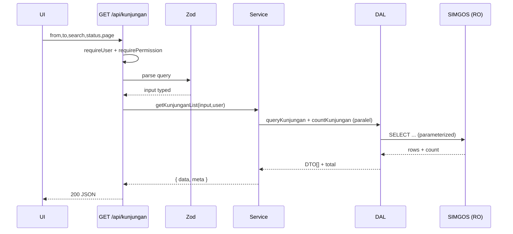

# Workflow — Kunjungan Pasien

> Menu **Kunjungan Pasien**: menampilkan daftar kunjungan pasien dari SIMGOS
> (read-only), dengan filter, pencarian, dan pagination.

- **Modul:** `server/modules/kunjungan`
- **Route UI:** `/(dashboard)/kunjungan`
- **Endpoint:** `GET /api/kunjungan`
- **Permission:** `kunjungan:read`
- **Sumber data:** SIMGOS (`pendaftaran.kunjungan`, `master.pasien`, `master.unit`, `master.dokter` — *placeholder, konfirmasi discovery*)

---

## 1. Tujuan

Operator RS dapat melihat, mencari, dan menyaring daftar kunjungan pasien sebagai
titik awal—baik untuk pemantauan maupun sebagai pintu masuk ke cetak resume medik.

## 2. User Story

> Sebagai **operator**, saya ingin melihat daftar kunjungan pada rentang tanggal
> tertentu, mencari berdasarkan nama/no. RM, dan menyaring per unit/status, agar
> cepat menemukan kunjungan yang saya butuhkan.

## 3. Alur Pengguna

1. Buka menu **Kunjungan Pasien**.
2. Default menampilkan kunjungan **hari ini** (atau rentang default) halaman 1.
3. Ubah filter: rentang tanggal, kata kunci (nama/no RM), unit, status.
4. Hasil diperbarui; navigasi antar halaman via pagination.
5. (Nanti) klik baris berstatus **SELESAI** → menuju cetak resume medik.

---

## 4. Kontrak API

**Request** — `GET /api/kunjungan`

| Query | Tipe | Wajib | Default | Keterangan |
|---|---|---|---|---|
| `from` | date (ISO) | ya | — | tanggal awal |
| `to` | date (ISO) | ya | — | tanggal akhir (≥ `from`) |
| `search` | string | tidak | — | nama pasien / no RM |
| `status` | enum | tidak | — | `BARU\|DALAM_PROSES\|SELESAI\|BATAL` |
| `unit` | string | tidak | — | id/kode unit |
| `page` | int ≥1 | tidak | 1 | |
| `pageSize` | int 1..100 | tidak | 25 | |

**Response 200**

```jsonc
{
  "data": [
    {
      "id": "10231",
      "nomorKunjungan": "RJ-2026-07-000123",
      "namaPasien": "Budi Santoso",
      "noRekamMedis": "00-12-34-56",
      "tanggalKunjungan": "2026-07-16T08:15:00.000Z",
      "unit": "Poli Umum",
      "dokter": "dr. Andi",
      "status": "SELESAI"
    }
  ],
  "meta": { "page": 1, "pageSize": 25, "total": 132, "totalPages": 6 }
}
```

Error: `422` validasi, `401` belum login, `403` tak berhak, `500` internal.
(Bentuk error → [../04-backend-layering.md](../04-backend-layering.md) §6.)

---

## 5. Validasi (Zod) — `kunjungan.schema.ts`

- `from`, `to`: `z.coerce.date()`; refine `from <= to`.
- `search`: trim, 1..100 char.
- `status`: enum 4 nilai.
- `page`/`pageSize`: coerce int, batas 1..100 (cegah page besar mendadak).
- Rentang tanggal **maksimal** (mis. 92 hari) untuk lindungi kinerja — opsional.

Lihat contoh schema di [../04-backend-layering.md](../04-backend-layering.md) §3.

---

## 6. Logika Service — `getKunjunganList(input, user)`

1. `requirePermission(user, "kunjungan:read")`.
2. Hitung `offset` dari `page`/`pageSize`.
3. Jalankan paralel: `queryKunjungan(...)` + `countKunjungan(...)`.
4. Susun `{ data, meta }`.
5. (Opsional) audit ringan `VIEW_KUNJUNGAN_LIST` bila diperlukan kebijakan.

Tanpa aturan bisnis berat di sini — ini list read. Aturan berat ada di resume medik.

---

## 7. DAL — `kunjungan.dal.ts`

- `queryKunjungan(args)` → raw parameterized lintas-DB, map row→DTO.
- `countKunjungan(args)` → `COUNT(*)` dengan filter sama.
- **Semua** nilai filter di-bind (tagged template `$queryRaw`). Tidak ada string-concat.

Contoh implementasi → [../04-backend-layering.md](../04-backend-layering.md) §2.2.

> ⚠️ Nama tabel/kolom (`pendaftaran.kunjungan`, `k.status`, dst.) **placeholder**.
> Finalisasi setelah discovery ([../03-database-prisma.md](../03-database-prisma.md) §2).

---

## 8. Mapping Status

Kode status SIMGOS → enum DTO (`STATUS_MAP` di `kunjungan.mapper.ts`). Konfirmasi
nilai kode asli saat discovery; sesuaikan peta. Nilai tak dikenal → fallback aman.

---

## 9. UI

- **Filter bar:** DateRangePicker, input pencarian (debounce), select unit, select status, tombol Reset.
- **Tabel kolom:** No. Kunjungan · Pasien (nama + no RM) · Tanggal/Jam · Unit · Dokter · Status (badge) · Aksi.
- **Pagination** server-side; filter tersinkron ke **URL** (bookmarkable).
- **State:** Loading (skeleton baris), Empty ("Tidak ada kunjungan pada rentang ini"), Error (coba lagi), Data.
- **Animasi:** stagger fade-in baris saat data baru (Framer Motion).

---

## 10. Edge Cases

| Kasus | Perilaku |
|---|---|
| `from > to` | 422 dengan pesan jelas |
| Rentang sangat lebar | Batasi (mis. 92 hari) atau paksa pagination kecil |
| Data kosong | Empty state, bukan error |
| Nama pasien null / dokter null | Tampilkan "—" |
| Status kode tak dikenal | Fallback `BARU` + catat log peringatan |
| Pencarian no RM berformat khusus | Normalisasi input sebelum bind |

---

## 11. Sequence



---

## 12. Definition of Done

- [ ] Endpoint tervalidasi, ter-auth, terpaginasi, typed end-to-end.
- [ ] Query 100% parameterized; hanya DAL menyentuh `simgos`.
- [ ] 4 state UI + animasi list.
- [ ] Filter tersinkron URL.
- [ ] Unit test mapper & validasi; integrasi DAL pada data sampel.
