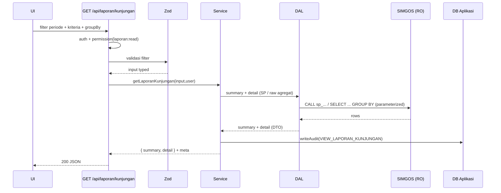

# Workflow — Laporan Kunjungan Pasien

> Report **rekap kunjungan pasien** dengan filter fleksibel + ringkasan. Berbeda
> dari menu "Kunjungan Pasien" (list operasional), ini berorientasi **rekapitulasi
> & cetak laporan**.

- **Modul:** `server/modules/laporan-kunjungan`
- **Route UI:** `/(dashboard)/laporan/kunjungan`
- **Endpoint:** `GET /api/laporan/kunjungan`
- **Permission:** `laporan:read`
- **Sumber data:** SIMGOS — **stored procedure bila tersedia**, jika tidak, raw agregat lintas-DB.

---

## 1. Tujuan

Menghasilkan laporan kunjungan yang bisa **difilter, diringkas, dibaca, dan dicetak**
untuk kebutuhan pelaporan manajemen/rekam medis yang tidak disediakan SIMGOS.

## 2. User Story

> Sebagai **operator/manajemen**, saya ingin merekap kunjungan pada periode & kriteria
> tertentu (unit, dokter, status, cara bayar) lengkap dengan angka ringkasan, agar
> bisa dianalisis dan dicetak.

---

## 3. Filter

| Filter | Tipe | Wajib | Keterangan |
|---|---|---|---|
| `from` / `to` | date | ya | Periode laporan (`from ≤ to`) |
| `unit` | string | tidak | Unit/poli |
| `dokter` | string | tidak | Dokter penanggung jawab |
| `status` | enum | tidak | `BARU\|DALAM_PROSES\|SELESAI\|BATAL` |
| `caraBayar` | enum/string | tidak | mis. UMUM / BPJS / ASURANSI (*konfirmasi discovery*) |
| `jenisKunjungan` | enum/string | tidak | Rawat Jalan / IGD / Rawat Inap (*konfirmasi*) |
| `groupBy` | enum | tidak | `TANGGAL\|UNIT\|DOKTER\|CARA_BAYAR` untuk mode rekap |
| `page` / `pageSize` | int | tidak | Untuk mode detail |

> Semua filter opsional di-treat sebagai "abaikan bila kosong" dalam query (pola
> `(${p} IS NULL OR kolom = ${p})`), dengan nilai **selalu di-bind**.

---

## 4. Dua Mode Tampilan

1. **Ringkasan (summary/agregat)** — jumlah kunjungan per grup (`groupBy`), plus
   kartu total: total kunjungan, jumlah selesai, batal, per cara bayar.
2. **Detail** — daftar kunjungan (mirip menu Kunjungan) untuk periode & filter,
   terpaginasi, sebagai lampiran laporan.

Response menyertakan **summary** + **data** (detail) sesuai mode.

---

## 5. Kontrak API

**Request** — `GET /api/laporan/kunjungan?from=..&to=..&unit=..&groupBy=UNIT`

**Response 200**

```jsonc
{
  "data": {
    "summary": {
      "totalKunjungan": 1280,
      "totalSelesai": 1102,
      "totalBatal": 34,
      "perCaraBayar": [
        { "caraBayar": "BPJS",  "jumlah": 812 },
        { "caraBayar": "UMUM",  "jumlah": 468 }
      ],
      "grup": [
        { "label": "Poli Umum", "jumlah": 420 },
        { "label": "IGD",       "jumlah": 260 }
      ]
    },
    "detail": [
      { "id": "10231", "nomorKunjungan": "RJ-...", "namaPasien": "Budi",
        "tanggalKunjungan": "2026-07-16T08:15:00.000Z", "unit": "Poli Umum",
        "dokter": "dr. Andi", "caraBayar": "BPJS", "status": "SELESAI" }
    ]
  },
  "meta": {
    "periode": { "from": "2026-07-01", "to": "2026-07-16" },
    "page": 1, "pageSize": 25, "total": 1280, "totalPages": 52,
    "groupBy": "UNIT"
  }
}
```

---

## 6. Validasi (Zod) — `laporan-kunjungan.schema.ts`

- Periode wajib, `from ≤ to`, dan **batas maksimal periode** (mis. 1 tahun) untuk
  lindungi kinerja agregat.
- `groupBy` enum; default mode detail bila tidak diisi.
- Enum `status`, `caraBayar`, `jenisKunjungan` (nilai final dari discovery).
- Pagination hanya berlaku untuk `detail`.

---

## 7. Logika Service — `getLaporanKunjungan(input, user)`

1. `requirePermission(user, "laporan:read")`.
2. Ambil **summary** (agregat) dan **detail** (paginasi) — paralel bila memungkinkan.
3. Rakit response `{ summary, detail }` + `meta`.
4. **Audit** `VIEW_LAPORAN_KUNJUNGAN` dengan `resourceRef` = ringkasan filter (periode+kriteria).
5. Tidak ada mutasi apa pun (read-only).

---

## 8. DAL — `laporan-kunjungan.dal.ts`

Strategi (pilih sesuai hasil discovery):

- **A. Stored procedure** (jika SIMGOS punya SP rekap kunjungan):
  ```ts
  const rows = await callProcedure<LaporanRow>(
    SIMGOS_SP.LAPORAN_KUNJUNGAN.name,
    [from, to, unitId],
  );
  ```
- **B. Raw agregat** (jika tidak ada SP): `SELECT ... COUNT(*) ... GROUP BY ...`
  lintas-DB, parameterized. Fungsi terpisah: `queryLaporanSummary`, `queryLaporanGroup`,
  `queryLaporanDetail`, `countLaporanDetail`.

Semua nilai filter **di-bind**; nama SP dari **registry**; nama kolom/tabel tetap.

> ⚠️ Bila SP mengembalikan **banyak result set**, ikuti catatan di
> [../03-database-prisma.md](../03-database-prisma.md) §5.2 (minta SP single result set
> atau gunакан strategi B).

---

## 9. UI

- **Panel filter** lengkap (tersinkron URL) + tombol Terapkan/Reset + Simpan Filter
  (`SavedFilter` di DB aplikasi).
- **Kartu ringkasan** (Framer Motion count-up): Total, Selesai, Batal, per cara bayar.
- **Chart opsional** (fase lanjut) — bar per unit/hari. Bila dibuat, ikuti skill **dataviz**.
- **Tabel rekap** (grup) + **tabel detail** (paginasi) di tab terpisah.
- **Aksi cetak/ekspor:** tombol Cetak (print CSS laporan) & Ekspor CSV.
- **State:** Loading/Empty/Error/Data.

---

## 10. Cetak Laporan

- Route/print view khusus laporan (kop RS, periode, filter aktif, tabel rekap+detail,
  footer: dicetak oleh, tanggal cetak).
- Fase 1 browser print; fase 2 PDF (Puppeteer). Pola sama dengan resume medik.

---

## 11. Edge Cases

| Kasus | Perilaku |
|---|---|
| Periode kosong hasil | Ringkasan nol + tabel Empty, bukan error |
| Periode terlalu lebar | Ditolak validasi (batas maks) atau paksa agregasi |
| `groupBy` diisi tapi detail besar | Batasi detail via pagination; summary tetap penuh |
| Cara bayar tidak dikenal di data | Kelompokkan sebagai "Lainnya" |
| SP lambat | Timeout wajar + pesan; sarankan persempit filter |

---

## 12. Sequence



---

## 13. Definition of Done

- [ ] Filter lengkap tervalidasi; periode dibatasi wajar.
- [ ] Summary + detail benar & cocok dengan sampel data SIMGOS.
- [ ] Query/SP parameterized; nama SP dari registry.
- [ ] Audit `VIEW_LAPORAN_KUNJUNGAN` tertulis.
- [ ] Cetak/ekspor laporan berfungsi (fase 1: print).
- [ ] 4 state UI; filter tersinkron URL; bisa disimpan sebagai preset.
